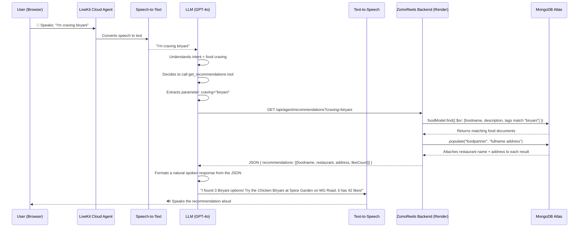
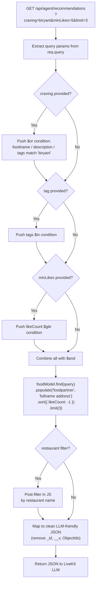
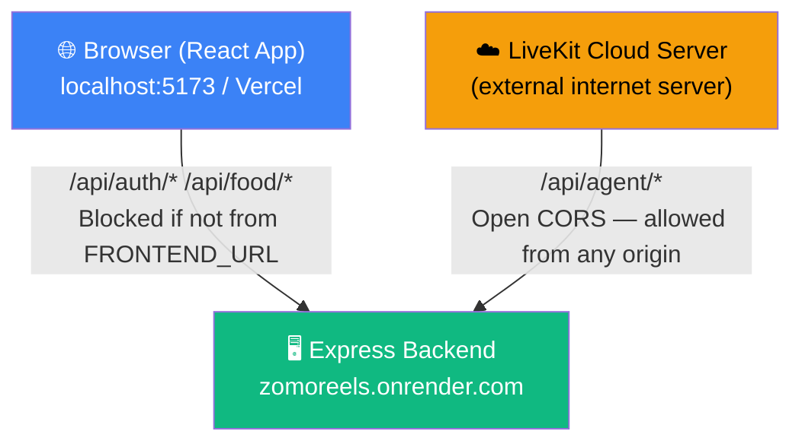
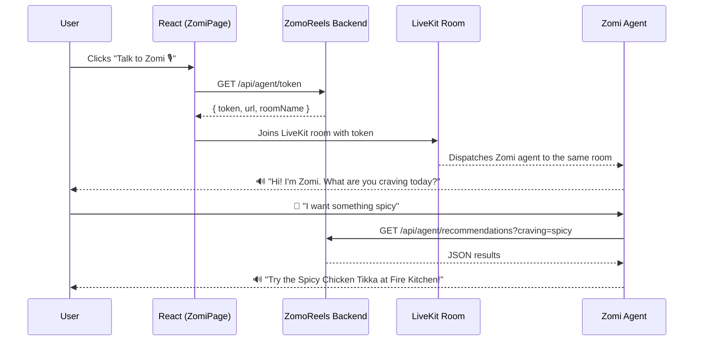
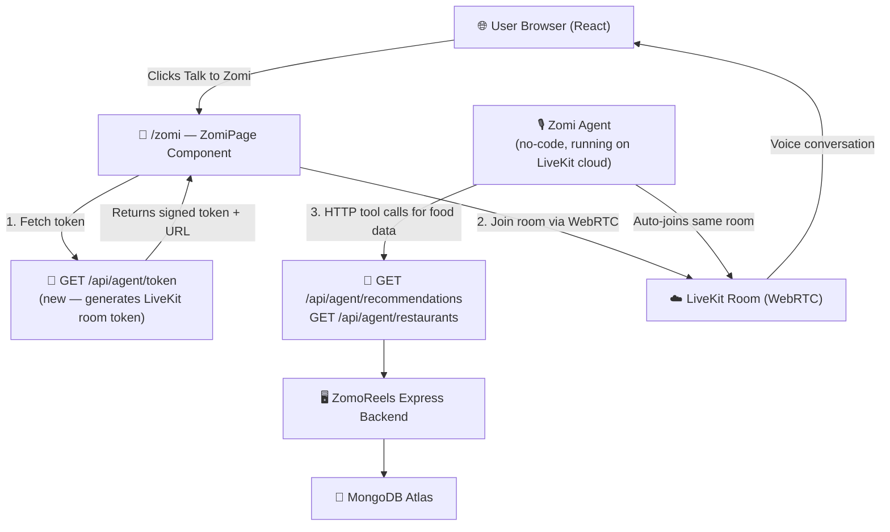

# 🤖 AGENT.md — ZomoReels AI Voice Agent (Zomi) — Full Documentation

> **This document covers everything:** what Zomi is, how it was built, how every piece connects, what is working right now, and what needs to be built next.

---

## Table of Contents

1. [What Is Zomi?](#what-is-zomi)
2. [Architecture Overview](#architecture-overview)
3. [Phase 1 — No-Code Agent (Current Working State)](#phase-1--no-code-agent-current-working-state)
4. [Full Request Flow — Step by Step](#full-request-flow--step-by-step)
5. [Backend Agent API — Deep Dive](#backend-agent-api--deep-dive)
6. [Bug Fixes Applied](#bug-fixes-applied)
7. [Phase 2 — Embedded Frontend Agent (Future)](#phase-2--embedded-frontend-agent-future)
8. [Full Future Architecture](#full-future-architecture)
9. [Files Reference](#files-reference)
10. [LiveKit HTTP Tool Configuration](#livekit-http-tool-configuration)

---

## What Is Zomi?

**Zomi** is the AI voice assistant for ZomoReels. It is a conversational agent that:
- Understands what food a user is craving (via natural language)
- Searches the live ZomoReels MongoDB database for matching food reels and restaurants
- Speaks the results back to the user

Zomi is built using **LiveKit's no-code Agent Builder** — a browser-based tool where you define an AI agent's personality, voice, and tools without writing agent code. Zomi's "tools" are HTTP calls to the ZomoReels Express backend.

**Key principle:** Zomi does not change the UI. It is a voice layer that talks to your backend and speaks results aloud. The React frontend is not involved in the current Phase 1 setup.

---

## Architecture Overview

### Phase 1 (Current — No-Code Agent in Browser)

```
┌─────────────────────────────────────────────────────────────────┐
│                        LIVEKIT CLOUD                            │
│                                                                 │
│  ┌──────────────────────────────────────────────────────────┐   │
│  │              No-Code Agent Builder UI                    │   │
│  │                                                          │   │
│  │   System Prompt: Zomi persona + instructions            │   │
│  │   LLM: Processes user speech, decides tool calls        │   │
│  │   TTS: Text-to-speech (speaks responses aloud)          │   │
│  │   STT: Speech-to-text (hears the user)                  │   │
│  │                                                          │   │
│  │   HTTP Tool 1: get_recommendations                      │   │
│  │   HTTP Tool 2: get_restaurants                          │   │
│  └──────────────────────┬───────────────────────────────────┘   │
│                         │  HTTP GET requests                    │
└─────────────────────────┼───────────────────────────────────────┘
                          │
                          ▼
┌─────────────────────────────────────────────────────────────────┐
│               RENDER.COM (Express Backend)                      │
│               https://zomoreels.onrender.com                    │
│                                                                 │
│   GET /api/agent/recommendations?craving=...&tag=...           │
│   GET /api/agent/restaurants?name=...&address=...              │
│                                                                 │
│   agent.routes.js → agent.controllers.js                       │
│                         │                                       │
│                         ▼                                       │
│                    MongoDB Atlas                                 │
│              (foodmodels + foodpartners collections)            │
└─────────────────────────────────────────────────────────────────┘
```

---

## Phase 1 — No-Code Agent (Current Working State)

### What is working right now

| Feature | Status |
|---|---|
| Zomi agent persona configured in LiveKit | ✅ Working |
| `get_recommendations` HTTP tool | ✅ Working |
| `get_restaurants` HTTP tool | ✅ Working |
| CORS open for `/api/agent/*` (LiveKit can call the API) | ✅ Fixed & deployed |
| Food model has `timestamps` (`createdAt`, `updatedAt`) | ✅ Fixed & deployed |
| `foodpartnerModel` correctly imported in agent controller | ✅ Fixed & deployed |
| Agent accessible in LiveKit browser playground | ✅ Working |
| Dedicated read-only `/api/agent` routes (cannot modify data) | ✅ Working |

### What the agent can answer right now

- "I'm craving pizza" → fetches food reels matching pizza from DB
- "Show me spicy food with over 10 likes" → filters by tag + minLikes
- "What restaurants are available in Bandra?" → fetches restaurant list filtered by area
- "Find me food from The Tandoor House" → filters food reels by restaurant name
- "What are the most popular dishes?" → sorts by likeCount descending

---

## Full Request Flow — Step by Step

Here is the exact sequence of what happens when a user says **"I'm craving biryani"** to Zomi:



---

### MongoDB Query Flow (Inside the Backend)



---

### CORS Architecture — Why `/api/agent` Has Open CORS



**Why this is safe:** The `/api/agent` routes are all `GET` requests only. They read data from the database and return it — they cannot create, update, or delete anything. Opening CORS on read-only routes does not create any security risk.

---

## Backend Agent API — Deep Dive

### File: `backend/src/controllers/agent.controllers.js`

This file has two exported async functions:

#### `getFoodRecommendations`

| Step | Code | What Happens |
|---|---|---|
| 1 | `const { craving, tag, restaurant, minLikes, limit } = req.query` | Extract all optional parameters the agent may send |
| 2 | `andConditions.push({ $or: [...] })` | Build a case-insensitive regex search across foodname, description, and tags |
| 3 | `andConditions.push({ tags: { $in: [...] } })` | If tag is provided, add a separate tag filter |
| 4 | `andConditions.push({ likeCount: { $gte: min } })` | If minLikes is provided, filter to popular items only |
| 5 | `foodModel.find({ $and: andConditions })` | Run the combined query against MongoDB |
| 6 | `.populate("foodpartner", "fullname address")` | Join each food item with its restaurant document |
| 7 | `.sort({ likeCount: -1 })` | Return most-liked first |
| 8 | `foods.filter(f => f.foodpartner?.fullname...includes(...))` | Post-filter by restaurant name in memory |
| 9 | `filtered.map(food => ({ foodname, restaurant, ... }))` | Strip internal DB fields, return only what the LLM needs |

#### `getRestaurants`

| Step | Code | What Happens |
|---|---|---|
| 1 | `const { name, address, limit } = req.query` | Extract search params |
| 2 | Build `$and` query for name and/or address regex | Case-insensitive restaurant search |
| 3 | `foodpartnerModel.find(query, "fullname address phone contactName image")` | Fetch only the needed fields (projection) |
| 4 | `partners.map(p => ({ name, address, phone, hasAvatar }))` | Return clean response without password or sensitive fields |

### File: `backend/src/routes/agent.routes.js`

```js
router.get("/recommendations", agentController.getFoodRecommendations);
router.get("/restaurants",     agentController.getRestaurants);
```

Both routes are public — no JWT middleware. This is intentional because the LiveKit server has no user session.

### File: `backend/src/app.js` (CORS section)

```js
// Open CORS for AI agent routes — called by LiveKit cloud, not the browser
app.use("/api/agent", cors({ origin: "*" }));

// Restricted CORS for all browser routes — only the configured frontend
app.use(cors({ origin: process.env.FRONTEND_URL, credentials: true }));
```

The order matters — Express matches middleware top-down. The open-CORS policy for `/api/agent` is applied before the restricted policy, so agent routes get open access and all other routes remain protected.

---

## Bug Fixes Applied

### Bug 1 — `foodpartnerModel` was never imported (Critical Crash)

**Symptom:** Any call to `GET /api/agent/restaurants` would immediately throw:
```
ReferenceError: foodpartnerModel is not defined
```
**Root cause:** The controller used `foodpartnerModel` but the `require()` for it was missing.
**Fix:** Added `const foodpartnerModel = require("../models/foodpartner.models");` at the top of the file.

---

### Bug 2 — CORS blocked all LiveKit agent requests (Critical)

**Symptom:** Every HTTP tool call from the LiveKit agent would fail with a CORS error. The browser console would show:
```
Access to XMLHttpRequest at 'https://zomoreels.onrender.com/api/agent/...' 
from origin 'https://cloud.livekit.io' has been blocked by CORS policy
```
**Root cause:** The default `app.use(cors({ origin: process.env.FRONTEND_URL }))` only allows requests from the React frontend. LiveKit's servers are on a completely different domain.
**Fix:** Added `app.use("/api/agent", cors({ origin: "*" }))` before the main CORS middleware.

---

### Bug 3 — No `timestamps` on food model (Minor)

**Symptom:** Food documents had no `createdAt` or `updatedAt` fields, so the agent could not sort by "newest reels."
**Root cause:** `food.models.js` was missing `{ timestamps: true }` in the schema options.
**Fix:** Changed `mongoose.Schema({ ... })` to `mongoose.Schema({ ... }, { timestamps: true })`.

---

## Phase 2 — Embedded Frontend Agent (Future)

Phase 2 brings Zomi directly into the ZomoReels web app. Instead of using the LiveKit browser playground, users press a **"Talk to Zomi 🎙️"** button in the app and a dedicated voice page opens — styled in the ZomoReels CHOMP aesthetic.

### What needs to be built

#### Backend — Token Generation Endpoint

A new route `GET /api/agent/token` that uses the LiveKit Node.js server SDK to generate a signed room access token. The frontend needs this token to join a LiveKit room.

```
npm install livekit-server-sdk   (in backend)
```

New environment variables needed in Render:
```env
LIVEKIT_API_KEY    = your_livekit_api_key
LIVEKIT_API_SECRET = your_livekit_api_secret
LIVEKIT_URL        = wss://your-project.livekit.cloud
```

The endpoint will create a unique room per request, sign a token for that room, and return it along with the LIVEKIT_URL.

---

#### Frontend — ZomiPage Component

A new React page at `/zomi` with the following flow:



Required packages for frontend:
```
npm install @livekit/components-react livekit-client   (in frontend)
```

The ZomiPage will be styled in the ZomoReels CHOMP theme:
- Stark orange `#FF5A36` pulse animation on the mic button
- Dark background, cream text
- Animated waveform while Zomi is speaking
- Chat-style transcript panel showing what was said
- "End session" button to disconnect

---

## Full Future Architecture



---

## Files Reference

### Currently in the Repository

| File | Type | Purpose |
|---|---|---|
| `backend/src/controllers/agent.controllers.js` | **NEW** | `getFoodRecommendations` and `getRestaurants` — the full agent API logic |
| `backend/src/routes/agent.routes.js` | **NEW** | Mounts agent controllers at `GET /api/agent/recommendations` and `GET /api/agent/restaurants` |
| `backend/src/app.js` | **MODIFIED** | Added open CORS for `/api/agent/*` before the main restricted CORS policy |
| `backend/src/models/food.models.js` | **MODIFIED** | Added `{ timestamps: true }` for `createdAt` and `updatedAt` on food documents |
| `agent_prompt.md` | **NEW** | System prompt used to configure the Zomi agent persona in LiveKit no-code builder |

### To Be Built in Phase 2

| File | Type | Purpose |
|---|---|---|
| `backend/src/controllers/agent.controllers.js` | **MODIFY** | Add `generateToken` function using `livekit-server-sdk` |
| `backend/src/routes/agent.routes.js` | **MODIFY** | Add `GET /api/agent/token` route |
| `frontend/src/pages/general/ZomiPage.jsx` | **NEW** | The embedded voice chat page — styled in CHOMP theme |
| `frontend/src/styles/ZomiPage.css` | **NEW** | CHOMP-themed styles for the voice page |
| `frontend/src/routes/AppRoutes.jsx` | **MODIFY** | Add `/zomi` route pointing to `ZomiPage` |

---

## LiveKit HTTP Tool Configuration

These are the exact values to enter in the LiveKit no-code Agent Builder HTTP tool form:

### Tool 1 — `get_recommendations`

| Field | Value |
|---|---|
| **Tool name** | `get_recommendations` |
| **Description** | Use this tool when the user mentions food they are craving, a cuisine type, or wants popular dishes. Extract what the user wants and pass it as `craving`. If they want popular items, set `minLikes` to 5 or more. |
| **HTTP Method** | `GET` |
| **URL** | `https://zomoreels.onrender.com/api/agent/recommendations` |
| **Param: craving** | Type: string — The food or cuisine the user is craving (e.g. biryani, spicy, vegan) |
| **Param: tag** | Type: string — A specific food category tag |
| **Param: restaurant** | Type: string — A restaurant name to filter results |
| **Param: minLikes** | Type: number — Minimum likes threshold for popularity filtering |
| **Param: limit** | Type: number — Number of results to return, max 10 |
| **Silent** | OFF |

### Tool 2 — `get_restaurants`

| Field | Value |
|---|---|
| **Tool name** | `get_restaurants` |
| **Description** | Use this tool when the user asks what restaurants are available, or wants to search by area or restaurant name. |
| **HTTP Method** | `GET` |
| **URL** | `https://zomoreels.onrender.com/api/agent/restaurants` |
| **Param: name** | Type: string — Restaurant name to search for |
| **Param: address** | Type: string — Area or locality like Bandra or MG Road |
| **Param: limit** | Type: number — Number of results to return |
| **Silent** | OFF |

---

## System Prompt (Zomi Persona)

The full system prompt is in `agent_prompt.md`. Key points:

- **Name:** Zomi
- **Tone:** Energetic, food-loving, conversational
- **Greeting:** "Hi there! I am Zomi. Are you hungry?"
- **Scope:** Only discusses food, restaurants, and the ZomoReels app
- **Guardrails:** Never asks for passwords or payment info, redirects off-topic questions back to food

---

*This document is maintained as part of the ZomoReels project. Last updated: March 2026.*
