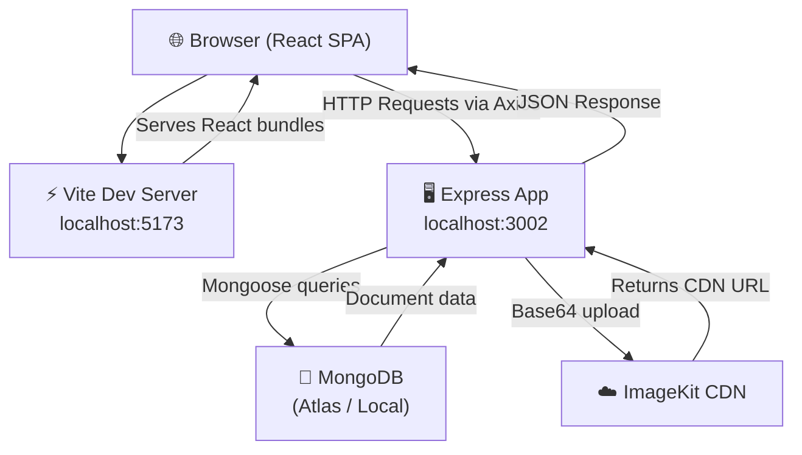
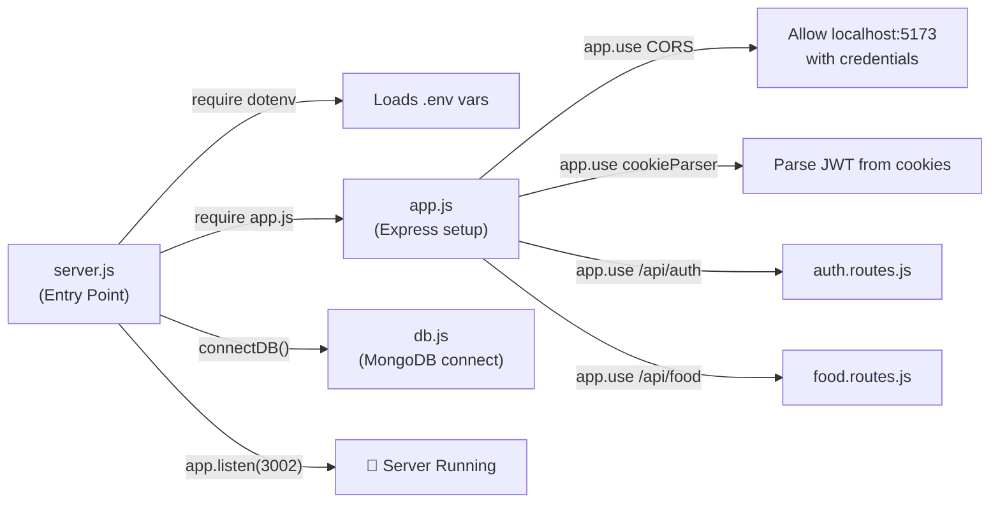
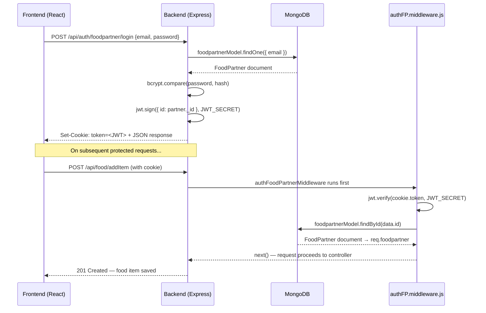
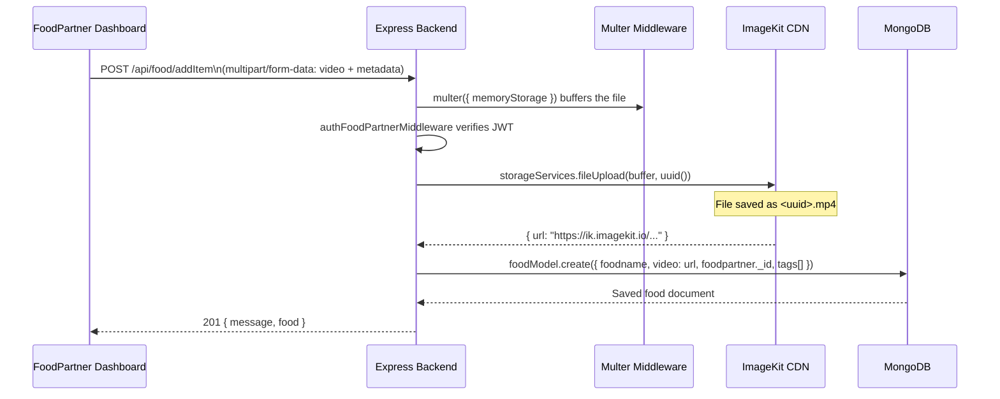
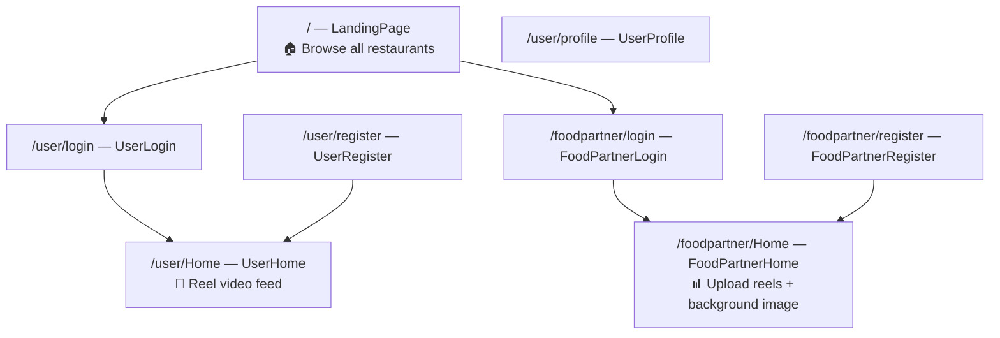

<h1 align="center">🍔 ReelFood</h1>
<h3 align="center">A Zomato-Inspired Full-Stack Food Discovery Platform with Reel-Style Short Video Feed</h3>

<p align="center">
  
  
  
  
  
  
  
</p>

---

## 📖 What Is This Project?

**ReelFood** is a full-stack food discovery web app built from scratch, inspired by Zomato's restaurant discovery experience combined with the short-video feed concept from Instagram Reels / TikTok.

The core idea: instead of browsing a static food menu, users scroll through **full-screen short video reels** of food items uploaded by restaurants — making food discovery more visual and engaging.

The platform has **two separate roles**:

| Role | Who They Are | What They Can Do |
|---|---|---|
| 👤 **User** | A regular food-lover | Browse restaurants, watch food reels in a swipeable video feed |
| 🍽️ **Food Partner** | A restaurant / food business | Register business, upload food videos, set restaurant background image, manage reels |

---

## ✨ Features

### For Users
- 🏠 **Landing Page** — See all registered restaurants with their background images, name, contact, and address
- 🔍 **Restaurant Search** — Filter restaurants by name in real time
- 🎥 **Reel-Style Video Feed** — Scroll through food videos fullscreen (like Instagram Reels), with snapping between each video
- 🔐 **Secure Auth** — Register & login, session maintained via HttpOnly JWT cookie

### For Food Partners
- 📋 **Restaurant Registration** — Full business onboarding (restaurant name, contact person, phone, address, email)
- 🎬 **Food Reel Upload** — Upload food item videos with a name, description, and tags — stored on ImageKit CDN
- 🖼️ **Background Image Upload** — Upload a restaurant cover image that shows on the public landing page
- 📊 **My Reels Dashboard** — View all uploaded food reels in one place
- 🔐 **Separate Authenticated Session** — Role-specific login, isolated from user sessions

---

## 🛠️ Tech Stack

### Frontend
| Technology | Version | Role in Project |
|---|---|---|
| **React** | 19.x | Core UI framework, component-driven architecture |
| **Vite** | 7.x | Blazing-fast dev server & production bundler |
| **React Router DOM** | 7.x | Declarative client-side routing for all pages |
| **Axios** | 1.x | HTTP client — all API calls go through Axios with `withCredentials: true` for cookie support |
| **Vanilla CSS** | — | Custom styling per page, no CSS frameworks |

### Backend
| Technology | Version | Role in Project |
|---|---|---|
| **Node.js** | — | JavaScript runtime |
| **Express** | 5.x | Web framework — defines routes, middleware chain, and API handlers |
| **MongoDB** | — | NoSQL database storing users, food partners, and food items |
| **Mongoose** | 9.x | Schema validation and ODM; defines `User`, `FoodPartner`, and `Food` models |
| **JWT** | 9.x | Issues signed tokens on login — verified on every protected request |
| **bcryptjs** | 3.x | Hashes passwords before saving (`salt rounds = 10`) |
| **Multer** | 2.x | Handles `multipart/form-data` for video & image uploads; uses in-memory buffer storage |
| **cookie-parser** | 1.x | Parses cookies from incoming requests so middleware can read JWT |
| **UUID** | 13.x | Generates unique filenames before uploading to ImageKit (prevents collision) |
| **CORS** | 2.x | Allows requests from frontend origin (`localhost:5173`) with cookies |
| **dotenv** | 17.x | Loads `.env` variables at startup |
| **nodemon** | 3.x | Auto-restarts backend during development |

### Cloud / Media
| Service | Purpose |
|---|---|
| **ImageKit** | Media CDN — videos uploaded as base64, stored as `.mp4`; images stored as `.jpg`. Returns a public CDN URL saved in MongoDB |
| **MongoDB Atlas** *(or local)* | Cloud database hosting |

---

## 🏗️ How The Project Is Structured

```
Zomato-app/
│
├── backend/                        ← Express REST API Server
│   ├── server.js                   ← Entry point: loads .env, connects DB, starts server on port 3002
│   └── src/
│       ├── app.js                  ← Express app setup: registers middleware & mounts routes
│       ├── controllers/            ← Business logic (the "brain" of each route)
│       │   ├── auth.controllers.js ← Register/Login/Logout for Users & FoodPartners; image upload
│       │   └── food.controllers.js ← Upload food reel, get all reels, get partner's own reels
│       ├── middlewares/
│       │   └── authFP.middleware.js ← JWT auth guards for FoodPartner & User protected routes
│       ├── models/                 ← Mongoose schemas (define DB structure)
│       │   ├── user.models.js      ← User: fullname, email, hashed password
│       │   ├── foodpartner.models.js ← FoodPartner: fullname, contact, phone, address, email, password, image URL
│       │   └── food.models.js      ← Food item: foodname, video URL, description, tags, ref → FoodPartner
│       ├── routes/                 ← Route definitions (URL → controller mapping)
│       │   ├── auth.routes.js      ← /api/auth/* (login, register, logout, image upload)
│       │   └── food.routes.js      ← /api/food/* (upload reel, fetch reels)
│       ├── services/
│       │   └── storage.services.js ← ImageKit integration: fileUpload() for videos, imageUpload() for images
│       └── db/
│           └── db.js               ← Mongoose connection to MongoDB
│
└── frontend/                       ← React 19 + Vite SPA
    └── src/
        ├── main.jsx                ← ReactDOM render root
        ├── App.jsx                 ← Root component — renders <AppRoutes />
        ├── routes/
        │   └── AppRoutes.jsx       ← All client-side routes defined here using React Router
        ├── pages/
        │   ├── auth/               ← UserLogin, UserRegister, FoodPartnerLogin, FoodPartnerRegister
        │   ├── general/            ← LandingPage (restaurants), UserHome (reel feed), UserProfile
        │   └── food-partner/       ← FoodPartnerHome (dashboard: upload reels + background image)
        └── styles/                 ← Per-page CSS files
```

---

## 🔗 How Files Connect — The Full Request Flow

### System Architecture



---

### Backend Boot Sequence



---

### Authentication Flow (Login → Protected Request)



---

### Video Upload Flow (Food Partner → ImageKit → MongoDB)



---

### Frontend Routing Map



All routes are defined in `AppRoutes.jsx` and rendered through `App.jsx → AppRoutes`.

---

## 📡 API Reference

### Auth Routes — `/api/auth`

| Method | Endpoint | Body / Params | Auth Required | What It Does |
|---|---|---|---|---|
| `POST` | `/user/register` | `{ fullname, email, password }` | ❌ | Creates user, hashes password, sets JWT cookie |
| `POST` | `/user/login` | `{ email, password }` | ❌ | Verifies credentials, sets JWT cookie |
| `GET` | `/user/logout` | — | ❌ | Clears JWT cookie |
| `POST` | `/foodpartner/register` | `{ fullname, contactName, phone, address, email, password }` | ❌ | Creates restaurant partner, sets JWT cookie |
| `POST` | `/foodpartner/login` | `{ email, password }` | ❌ | Verifies partner, sets JWT cookie |
| `GET` | `/foodpartner/logout` | — | ❌ | Clears JWT cookie |
| `POST` | `/foodpartner/image` | `FormData: image (file)` | ✅ FP Cookie | Uploads image to ImageKit, saves CDN URL to DB |
| `GET` | `/foodpartners` | — | ❌ | Returns all restaurant partners (for landing page) |

### Food / Reels Routes — `/api/food`

| Method | Endpoint | Body / Params | Auth Required | What It Does |
|---|---|---|---|---|
| `POST` | `/addItem` | `FormData: video, foodname, description, tags` | ✅ FP Cookie | Uploads video to ImageKit, saves food item to DB |
| `GET` | `/getItem` | — | ✅ User Cookie | Returns all food reels (for user reel feed) |
| `GET` | `/getFoodpartnerItems` | — | ✅ FP Cookie | Returns only the logged-in partner's uploaded reels |

---

## 🗄️ Database Schema Design

### `users` Collection
```js
{
  fullname : String  (required),
  email    : String  (required, unique),
  password : String  (required — bcrypt hashed, never stored in plain text)
}
```

### `foodpartners` Collection
```js
{
  fullname    : String  (required — restaurant name),
  contactName : String  (required — owner/contact person),
  phone       : String  (required),
  address     : String  (required),
  email       : String  (required, unique),
  password    : String  (required — bcrypt hashed),
  image       : String  (default: "" — ImageKit CDN URL for background image)
}
```

### `foodmodels` Collection
```js
{
  foodname    : String   (required),
  video       : String   (required — ImageKit CDN URL for the reel video),
  description : String,
  tags        : [String] (default: [] — comma-separated, parsed on upload),
  foodpartner : ObjectId (ref → foodpartners — links reel to its restaurant)
}
```

> The `foodpartner` field on each food item is a **Mongoose reference** (`ref: "foodpartner"`), enabling population queries to join reel data with restaurant data in a single query.

---

## 🔐 Security Design

### Why HttpOnly Cookies?

Most tutorials store JWT tokens in `localStorage`. This project uses **HttpOnly cookies** instead — here's why:

| Storage Method | XSS Vulnerable? | CSRF Vulnerable? | Used Here? |
|---|---|---|---|
| `localStorage` | ✅ Yes — any JS on page can read it | ❌ No | ❌ |
| HttpOnly Cookie | ❌ No — JS cannot access it | ✅ Yes (mitigated by CORS + credentials policy) | ✅ |

- On login, the server calls `res.cookie("token", jwt)` — the browser stores it automatically
- On every request from React, Axios sends `withCredentials: true` — cookie is attached automatically  
- Express reads it via `req.cookies.token` (enabled by `cookie-parser`)
- Middleware verifies and decodes the JWT, then attaches the full user/partner document to `req`

### Dual-Role Auth

Both Users and Food Partners use the same `token` cookie name but go through **separate middleware functions** (`authUserMiddleware` and `authFoodPartnerMiddleware`). Each middleware looks up the decoded ID in its respective MongoDB collection, so a user token cannot impersonate a food partner and vice versa.

---

## 🚀 Getting Started (Local Setup)

### Prerequisites
- Node.js v18+
- MongoDB running locally or a MongoDB Atlas URI
- An [ImageKit](https://imagekit.io) account (free tier works)

### 1. Clone the Repository
```bash
git clone https://github.com/gauravs2430/Reel-STyle-Video-Feed-Integration-of-Zomato-like-app.git
cd Reel-STyle-Video-Feed-Integration-of-Zomato-like-app
```

### 2. Backend Setup
```bash
cd backend
npm install
```

Create `/backend/.env`:
```env
PORT=3002
MONGO_URI=your_mongodb_connection_string
JWT_SECRET=your_super_secret_key
IMAGEKIT_PUBLIC_KEY=your_imagekit_public_key
IMAGEKIT_PRIVATE_KEY=your_imagekit_private_key
IMAGEKIT_URL_ENDPOINT=https://ik.imagekit.io/your_imagekit_id
```

Start backend:
```bash
npx nodemon server.js
# Server listening on http://localhost:3002
```

### 3. Frontend Setup
```bash
cd ../frontend
npm install
npm run dev
# App running on http://localhost:5173
```

> ⚠️ The frontend is hardcoded to call `http://localhost:3002` — make sure the backend is running before using the frontend.

---

## 🗺️ Roadmap

- [x] Dual-role authentication — User & Food Partner with HttpOnly JWT cookies
- [x] Reel-style fullscreen vertical video feed for users
- [x] Food Partner dashboard with video (reel) upload to ImageKit
- [x] Restaurant background image upload & live display on landing page
- [x] Restaurant search/filter on landing page
- [x] Tags support on food items
- [ ] Comments & likes on food reels
- [ ] User favorites / saved restaurants
- [ ] Location-based restaurant filtering (geolocation)
- [ ] Follow a restaurant — get notified on new reels
- [ ] Admin panel for platform management
- [ ] Full mobile-responsive UI
- [ ] Payment & ordering system integration
- [ ] Refresh token + token expiry (currently tokens don't expire)

---

## 👨‍💻 Author

**Gaurav** — [@gauravs2430](https://github.com/gauravs2430)

---

## ⚠️ Development Status

> **🚧 This project is actively under development.**
>
> The core architecture is in place and major features are functional. The codebase is being actively expanded with new features, UI polish, and security improvements. Not yet production-ready — but the foundations (auth, routing, media pipeline, dual-role system) are solid and built with industry-standard patterns.
>
> Feel free to explore the code, raise issues, or suggest improvements!

---

<p align="center">Built with ❤️ by Gaurav &nbsp;|&nbsp; Powered by React, Express & MongoDB</p>
